# Galerie des textures originales du JAR

**Ces images sont les textures internes du mod** ; elles ne sont pas des captures du rendu des entités en 3D.

## Golems (16)

 `diamond`  
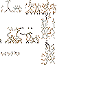 `diamond_crackiness_high`  
 `diamond_crackiness_low`  
 `diamond_crackiness_medium`  
 `emerald`  
 `emerald_crackiness_high`  
 `emerald_crackiness_low`  
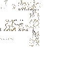 `emerald_crackiness_medium`  
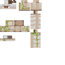 `gold`  
 `gold_crackiness_high`  
 `gold_crackiness_low`  
 `gold_crackiness_medium`  
 `netherite`  
 `netherite_crackiness_high`  
 `netherite_crackiness_low`  
 `netherite_crackiness_medium`  

## Créatures / Creatures (9)

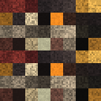 `demon_commandant`  
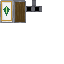 `explosive_shield`  
 `goule`  
 `illageois_demi_squelette`  
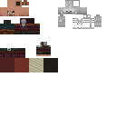 `illageois_gueri`  
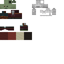 `illageois_zombifie`  
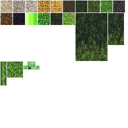 `maitre_creeper`  
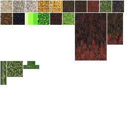 `maitre_des_zombies`  
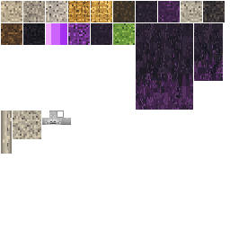 `maitre_squelette`  

## Objets / Items (31)

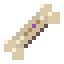 `ancient_bone`  
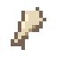 `bone_fragment`  
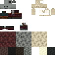 `cursed_bone`  
 `demon_horn`  
 `diamond_crowned_helmet_1`  
 `diamond_crowned_helmet_2`  
 `diamond_crowned_helmet_3`  
 `diamond_crowned_helmet_4`  
 `diamond_crowned_helmet_5`  
 `diamond_crowned_helmet_6`  
 `diamond_crowned_helmet_7`  
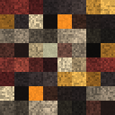 `ghoul_fang`  
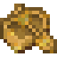 `golden_boat`  
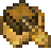 `golden_chest_boat`  
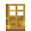 `golden_door`  
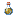 `golden_elixir`  
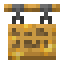 `golden_hanging_sign`  
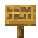 `golden_sign`  
 `golden_stick`  
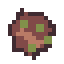 `improved_rotten_flesh`  
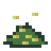 `master_tnt_powder`  
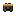 `netherite_crowned_helmet_1`  
 `netherite_crowned_helmet_2`  
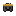 `netherite_crowned_helmet_3`  
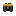 `netherite_crowned_helmet_4`  
 `netherite_crowned_helmet_5`  
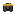 `netherite_crowned_helmet_6`  
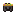 `netherite_crowned_helmet_7`  
 `restoration_stone`  
 `splash_golden_elixir`  
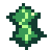 `unstable_heart_fragment`  

## Blocs / Blocks (26)

 `charged_tnt_bottom`  
 `charged_tnt_side`  
 `charged_tnt_top`  
 `cursed_bone`  
 `demon_trophy`  
 `ghoul_trophy`  
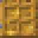 `golden_door_bottom`  
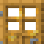 `golden_door_top`  
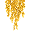 `golden_hanging_leaves`  
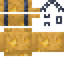 `golden_hanging_sign`  
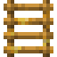 `golden_ladder`  
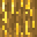 `golden_log`  
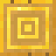 `golden_log_top`  
 `golden_petals`  
 `golden_petals_stem`  
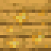 `golden_planks`  
 `golden_sapling`  
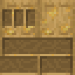 `golden_shelf`  
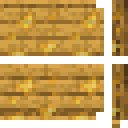 `golden_sign`  
 `golden_torch`  
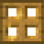 `golden_trapdoor`  
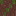 `improved_flesh_block`  
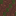 `rotten_flesh_block`  
 `skeleton_trophy`  
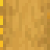 `stripped_golden_log`  
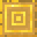 `stripped_golden_log_top`
